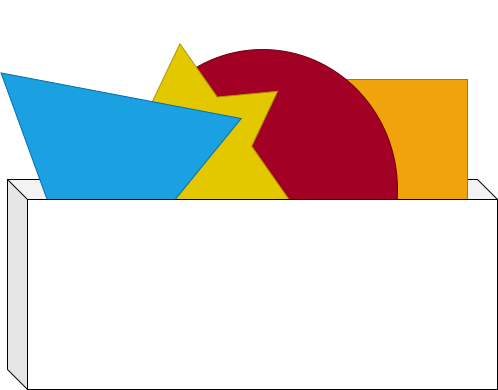

 Solid Shape Repo

This is a repository for storing and sharing solid shapes. This is designed to be a collaborative project similar to [DefinitelyTyped](https://github.com/DefinitelyTyped/DefinitelyTyped/).

Existing shapes are found [here](https://github.com/jeswr/shapeRepo/tree/main/shapes) and served and served at [https://www.shapes.jeswr.org/](https://www.shapes.jeswr.org/) with content negotiation.

New shapes can be contributed via a pull request. See [CONTRIBUTING.md](./CONTRIBUTING.md) for more information.

## License
©2023–present
[Jesse Wright](https://github.com/jeswr),
[MIT License](https://github.com/jeswr/useState/blob/master/LICENSE).

